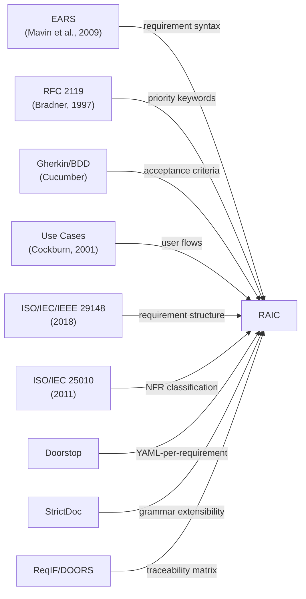
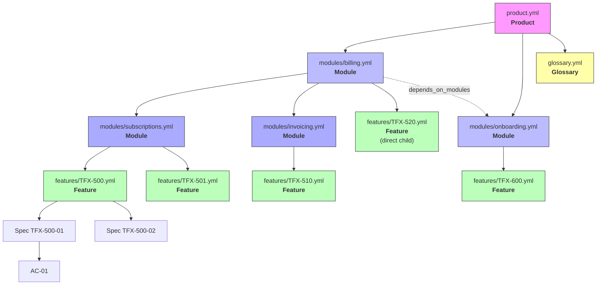
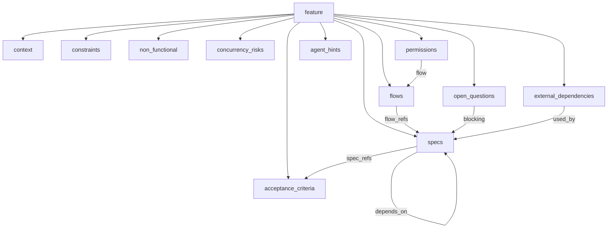
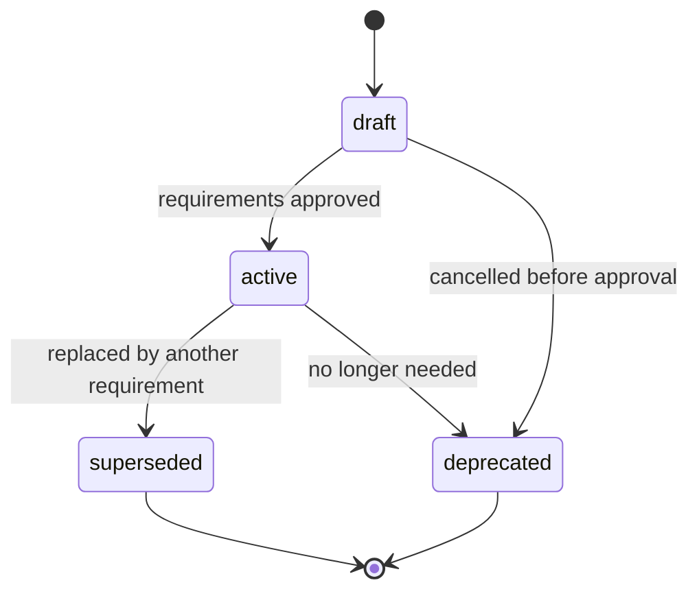
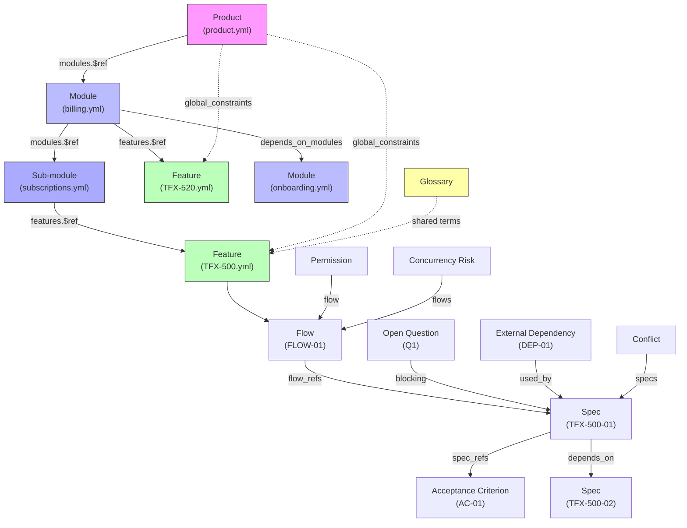

# RAIC — Requirements as Intelligent Code

## Specification v1.0

**RAIC** (Requirements as Intelligent Code) is a YAML-based domain-specific language for expressing software requirements in a structured, machine-parseable format optimized for AI-driven development agents.

---

## Table of Contents

- [1. Motivation](#1-motivation)
- [2. Design Philosophy](#2-design-philosophy)
- [3. Influences and References](#3-influences-and-references)
- [4. Format Overview](#4-format-overview)
  - [4.1 Document Types](#41-document-types)
  - [4.2 Product Hierarchy](#42-product-hierarchy)
  - [4.3 Directory Structure](#43-directory-structure)
- [5. Schema Reference](#5-schema-reference)
  - [5.1 Product (root)](#51-product-root)
  - [5.2 Module](#52-module)
  - [5.3 Glossary](#53-glossary)
  - [5.4 Feature (root)](#54-feature-root)
  - [5.5 Context](#55-context)
  - [5.6 Flows](#56-flows)
  - [5.7 Specs (Requirements)](#57-specs-requirements)
  - [5.8 Acceptance Criteria](#58-acceptance-criteria)
  - [5.9 Constraints](#59-constraints)
  - [5.10 Non-Functional Requirements](#510-non-functional-requirements)
  - [5.11 External Dependencies](#511-external-dependencies)
  - [5.12 Concurrency Risks](#512-concurrency-risks)
  - [5.13 Permissions](#513-permissions)
  - [5.14 Open Questions](#514-open-questions)
  - [5.15 Agent Hints](#515-agent-hints)
- [6. Priority Keywords](#6-priority-keywords)
- [7. Requirement Lifecycle](#7-requirement-lifecycle)
- [8. Traceability Model](#8-traceability-model)
- [9. Scalability: Simple vs Complex Features](#9-scalability-simple-vs-complex-features)
- [10. JSON Schema](#10-json-schema)
- [11. Complete Example](#11-complete-example)
- [12. Design Decisions and Rationale](#12-design-decisions-and-rationale)
- [13. References](#13-references)

---

## 1. Motivation

Traditional requirements management tools (DOORS, Jama, Polarion) are designed for human-to-human communication. Modern requirements-as-code tools (Doorstop, StrictDoc) improve on this by storing requirements in version-controlled text files, but they remain optimized for systems engineering workflows ("the system shall...") and lack first-class support for:

- **User interaction flows** with alternative and error paths
- **Acceptance criteria** in Given/When/Then format
- **Priority semantics** beyond simple numeric ranking
- **Conflict detection** between requirements
- **Concurrency risks** across interacting flows
- **AI agent consumption** — structured hints that help an autonomous agent plan implementation

RAIC fills this gap. It is designed to be:
1. **Written by humans** (product owners, developers, analysts)
2. **Consumed by AI agents** (for autonomous planning, implementation, and validation)
3. **Validated by machines** (via JSON Schema)
4. **Versioned in Git** (plain YAML, diff-friendly)

---

## 2. Design Philosophy

| Principle | Description |
|-----------|-------------|
| **Machine-first, human-readable** | Every field is parseable by code, but the format reads naturally |
| **Semantically rich** | Flows, acceptance criteria, dependencies, and conflicts are first-class citizens — not free-text afterthoughts |
| **Scalable complexity** | A simple task uses 20 lines; a complex feature uses the full schema. No mandatory bloat |
| **Traceable end-to-end** | Every acceptance criterion links to specs, every spec links to flows, every open question blocks specific specs |
| **Opinionated where it matters** | Uses established standards (EARS, RFC 2119, Gherkin) rather than inventing new semantics |
| **Lifecycle-aware** | Requirements can be drafted, activated, superseded, or deprecated — not just "done" or "not done" |

---

## 3. Influences and References

RAIC is not invented from scratch. Each element draws from a proven methodology:



| Source | What RAIC borrows | Why |
|--------|------------------|-----|
| **EARS** (Easy Approach to Requirements Syntax) | `When <trigger>, the system shall <response>` pattern | Eliminates ambiguity in natural language requirements. Proven in aerospace (Rolls-Royce) and automotive industries. See [Mavin et al., 2009](https://ieeexplore.ieee.org/document/5328509) |
| **RFC 2119** | `MUST`, `SHOULD`, `MAY`, `MUST NOT`, `SHOULD NOT` | Industry-standard priority keywords with unambiguous semantics. See [RFC 2119](https://www.ietf.org/rfc/rfc2119.txt) |
| **Gherkin** (Cucumber BDD) | `Given/When/Then` acceptance criteria | Maps directly to automated tests. Widely understood by developers and QA. See [Cucumber docs](https://cucumber.io/docs/gherkin/) |
| **Alistair Cockburn's Use Cases** | Flow structure with actors, triggers, steps, alternative paths, postconditions | The most practical use-case format. See [Cockburn, 2001 — Writing Effective Use Cases](https://www.oreilly.com/library/view/writing-effective-use/0201702258/) |
| **ISO/IEC/IEEE 29148:2018** | Requirement attributes (ID, rationale, source, verification method) | International standard for requirements engineering in systems and software. Defines the expected attributes every well-formed requirement should carry |
| **ISO/IEC 25010:2011** | Non-functional requirement categories (performance, security, reliability, etc.) | Standard quality model for software product quality characteristics |
| **Doorstop** | YAML as storage format, one-requirement-per-concept approach, Git-native workflow | Proven that YAML works for requirements-as-code. Its per-file approach produces clean diffs. See [Doorstop docs](https://doorstop.readthedocs.io/) |
| **StrictDoc** | Extensible grammar, custom field types, traceability roles | Demonstrated that a requirements tool can combine strictness with extensibility. See [StrictDoc docs](https://strictdoc.readthedocs.io/) |
| **ReqIF / IBM DOORS** | Traceability matrix concepts, bidirectional linking | Industry standard for requirement interchange. The traceability model (parent/child, refines, verifies) is well-established. See [ReqIF spec](https://www.omg.org/spec/ReqIF) |

---

## 4. Format Overview

### 4.1 Document Types

RAIC defines four document types, each stored as a separate YAML file:

| Document | Root key | Purpose | One per... |
|----------|----------|---------|------------|
| **Product** | `product` | Top-level container: stakeholders, global constraints, module index | Product |
| **Module** | `module` | Recursive grouping container: can nest other modules and/or features | Business domain, subdomain, capability, etc. |
| **Feature** | `feature` | Full feature specification with flows, specs, and acceptance criteria | Feature |
| **Requirement** | `requirement` | Simplified spec for small, standalone tasks (no flows) | Task |

Additionally, a **Glossary** (`glossary` root key) provides a shared vocabulary across all documents.

Modules are **recursive** — a module can contain sub-modules and/or features at any depth. This allows modeling systems of arbitrary complexity without artificial constraints on hierarchy depth.

### 4.2 Product Hierarchy

A product is a tree of documents with explicit references between levels:



Note how the Billing module contains both sub-modules (Subscriptions, Invoicing) and a direct feature (TFX-520 Tax Calculation) that belongs to the billing domain but not to any specific subdomain.

**Key principles:**

- **Recursive nesting** — modules can contain other modules to arbitrary depth, mirroring the natural structure of complex systems
- **References, not duplication** — modules reference children via `$ref`, never copy their content
- **Dependencies at every level** — module depends on module, feature on feature, spec on spec
- **Global constraints inherit downward** — a `MUST` in `product.yml` applies to every feature without repetition
- **Glossary prevents ambiguity** — all documents share the same term definitions
- **One file = one entity** — clean Git diffs, parallel work without merge conflicts

### 4.3 Directory Structure

```
requirements/
├── product.yml                          # Product manifest
├── glossary.yml                         # Shared terminology
├── modules/
│   ├── billing.yml                      # Module: billing domain
│   ├── billing/
│   │   ├── subscriptions.yml            # Sub-module: subscriptions
│   │   └── invoicing.yml                # Sub-module: invoicing
│   └── onboarding.yml                   # Module: onboarding domain
└── features/
    ├── TFX-500-plan-management.yml      # Feature (full RAIC)
    ├── TFX-501-upgrade-downgrade.yml    # Feature (full RAIC)
    ├── TFX-510-invoice-generation.yml   # Feature (full RAIC)
    ├── TFX-520-tax-calculation.yml      # Feature (full RAIC)
    ├── TFX-600-user-signup.yml          # Feature (full RAIC)
    └── TFX-9092-hello-world.yml         # Requirement (simple RAIC)
```

The directory structure mirrors the module hierarchy. Sub-modules are placed in a directory named after the parent module. Features are kept flat in `features/` regardless of which module they belong to — the module files reference them via `$ref`.

Within a feature document, the internal structure follows a top-down decomposition:



---

## 5. Schema Reference

### 5.1 Product (root)

The top-level container representing an entire product. One per product.

| Field | Type | Required | Description |
|-------|------|----------|-------------|
| `id` | string | yes | Product identifier (e.g., project key from Jira) |
| `title` | string | yes | Product name |
| `description` | string | yes | What the product does |
| `version` | string | no | Product version (semver recommended) |
| `stakeholders` | array of objects | yes | Product-level stakeholder roles. Each has `role` (string, required) and `description` (string, optional) |
| `modules` | array of objects | yes | References to top-level module files. Each entry has `$ref` (string, path to module YAML) |
| `global_constraints` | array of strings | no | Constraints that apply to ALL features in the product. Use RFC 2119 keywords |
| `global_non_functional` | array of NFR objects | no | Non-functional requirements inherited by all features |

**Example:**

```yaml
product:
  id: TFX
  title: AI Delivery Agent
  description: >
    Autonomous AI agent that picks up Jira tasks,
    analyzes requirements, writes code, and delivers PRs.
  version: 0.1.0

  stakeholders:
    - role: developer
      description: Uses the agent to automate routine dev tasks
    - role: team_lead
      description: Monitors agent output, approves PRs
    - role: product_owner
      description: Creates Jira tasks, reviews delivered features

  modules:
    - $ref: modules/billing.yml
    - $ref: modules/onboarding.yml

  global_constraints:
    - All features MUST pass RuboCop before delivery
    - All features MUST include tests with >80% coverage
    - All DB migrations MUST be reversible
    - Secrets MUST NOT be committed to the repository

  global_non_functional:
    - type: security
      statement: All endpoints MUST require authentication unless explicitly public
    - type: reliability
      statement: The system MUST handle external API failures gracefully
    - type: maintainability
      statement: Code MUST follow Rails conventions and project style guide
```

### 5.2 Module

A recursive grouping container. Modules organize features into a hierarchy of arbitrary depth — domains, subdomains, capabilities, or any structure that fits the product.

A module can contain:
- **Sub-modules** (`modules`) — references to child module files
- **Features** (`features`) — references to feature files
- **Both** — a module can have direct features AND sub-modules simultaneously

| Field | Type | Required | Description |
|-------|------|----------|-------------|
| `id` | string | yes | Module identifier |
| `title` | string | yes | Module name |
| `status` | enum | yes | `draft`, `active`, `superseded`, `deprecated` |
| `description` | string | yes | What this module covers |
| `modules` | array of objects | no | References to child module files. Each entry has `$ref` (string, path to module YAML) |
| `features` | array of objects | no | Feature references. Each has `id` (string), `$ref` (string, path to feature YAML), `status` (lifecycle enum), `priority` (RFC 2119 keyword), and optional `depends_on` (array of feature IDs within this module) |
| `depends_on_modules` | array of strings | no | IDs of modules that must be implemented before this one |
| `success_metrics` | array of objects | no | Measurable outcomes. Each has `metric` (string) and `target` (string) |

At least one of `modules` or `features` must be present — a module cannot be empty.

**Example — top-level module with sub-modules and a direct feature:**

```yaml
module:
  id: TFX-BILLING
  title: Billing & Subscriptions
  status: active
  description: >
    Everything related to payments, subscriptions,
    invoicing, and refunds.

  modules:
    - $ref: billing/subscriptions.yml
    - $ref: billing/invoicing.yml

  features:
    - id: TFX-520
      $ref: ../features/TFX-520-tax-calculation.yml
      status: active
      priority: MUST

  depends_on_modules: [TFX-ONBOARDING]

  success_metrics:
    - metric: support_ticket_reduction
      target: "-50% subscription-related tickets within 3 months"
    - metric: churn_rate
      target: "reduce monthly churn from 8% to 5%"
```

**Example — leaf module with only features (no sub-modules):**

```yaml
module:
  id: TFX-BILLING-SUB
  title: Subscriptions
  status: active
  description: >
    Plan management, upgrades, downgrades, and cancellations.

  features:
    - id: TFX-500
      $ref: ../../features/TFX-500-plan-management.yml
      status: active
      priority: MUST

    - id: TFX-501
      $ref: ../../features/TFX-501-upgrade-downgrade.yml
      status: draft
      priority: SHOULD
      depends_on: [TFX-500]
```

### 5.3 Glossary

A shared vocabulary ensuring consistent term usage across all product documents.

| Field | Type | Required | Description |
|-------|------|----------|-------------|
| `glossary` | array of term objects | yes | The list of terms |

Each term object:

| Field | Type | Required | Description |
|-------|------|----------|-------------|
| `term` | string | yes | The canonical term |
| `definition` | string | yes | Precise definition |
| `aliases` | array of strings | no | Alternative names for the same concept |
| `see_also` | array of strings | no | Related terms |

**Example:**

```yaml
glossary:
  - term: subscription
    definition: >
      A recurring billing agreement between a user and the platform.
      Has a plan, billing period, and status.
    aliases: [plan, membership]

  - term: proration
    definition: >
      Proportional charge or credit calculated when a subscription
      changes mid-billing-period.

  - term: billing_period
    definition: >
      The time interval between charges. Either monthly (30 days)
      or annual (365 days).

  - term: force_cancel
    definition: >
      Immediate subscription termination by an admin,
      bypassing the normal end-of-period cancellation.
    see_also: [cancellation, refund]
```

### 5.4 Feature (root)

The top-level container for a complex feature.

| Field | Type | Required | Description |
|-------|------|----------|-------------|
| `id` | string | yes | Unique identifier, matches the external tracker (e.g., Jira key) |
| `title` | string | yes | Human-readable feature title |
| `type` | enum | yes | `feature`, `bugfix`, `refactoring`, `spike` |
| `status` | enum | yes | `draft`, `active`, `superseded`, `deprecated` |
| `epic` | string | no | Parent epic ID |
| `superseded_by` | string | no | ID of the requirement that replaces this one (when status is `superseded`) |
| `context` | object | yes | Problem statement, impact, and stakeholders |
| `flows` | array | no | User interaction flows |
| `specs` | array | yes | Functional requirements |
| `acceptance_criteria` | array | yes | Testable acceptance criteria |
| `constraints` | array | no | Hard constraints on the implementation |
| `non_functional` | array | no | Non-functional requirements |
| `external_dependencies` | array | no | External services and their failure modes |
| `concurrency_risks` | array | no | Known race conditions and concurrent access scenarios |
| `permissions` | array | no | Access control rules |
| `conflicts` | array | no | Known conflicts between requirements |
| `open_questions` | array | no | Unresolved questions blocking implementation |
| `agent_hints` | object | no | AI-agent-specific metadata |

For simple tasks, use `requirement` as the root key instead of `feature`. The `requirement` root supports the same fields but `flows`, `concurrency_risks`, and `permissions` are omitted.

### 5.5 Context

Provides the "why" behind the feature.

| Field | Type | Required | Description |
|-------|------|----------|-------------|
| `problem` | string | yes | What problem does this feature solve? |
| `impact` | string | yes | What is the impact of not solving it? |
| `stakeholders` | array of objects | no | Who cares about this feature? Each entry has a `role` field |

### 5.6 Flows

Describe user interaction sequences. Based on [Cockburn's Use Case format](https://www.oreilly.com/library/view/writing-effective-use/0201702258/).

| Field | Type | Required | Description |
|-------|------|----------|-------------|
| `id` | string | yes | Unique flow identifier (e.g., `FLOW-01`) |
| `title` | string | yes | Human-readable flow title |
| `actor` | string | yes | Who initiates this flow (role name from `context.stakeholders`) |
| `trigger` | string | yes | What event starts this flow |
| `preconditions` | array of strings | no | Conditions that must be true before the flow starts |
| `steps` | array of objects | yes | Ordered sequence of interactions. Each step is a key-value pair where the key is the actor (`user`, `system`, `admin`, etc.) and the value is the action |
| `alternative_paths` | array of objects | no | Alternative flow branches. Each has `condition` (string) and `steps` (same format as main steps) |
| `error_paths` | array of objects | no | Error scenarios. Each has `condition` (string) and `steps` |
| `postconditions` | array of strings | yes | What must be true after the flow completes successfully |

### 5.7 Specs (Requirements)

Individual functional requirements using [EARS syntax](https://ieeexplore.ieee.org/document/5328509).

| Field | Type | Required | Description |
|-------|------|----------|-------------|
| `id` | string | yes | Unique requirement ID (e.g., `TFX-500-01`) |
| `priority` | enum | yes | `MUST`, `SHOULD`, `MAY`, `MUST_NOT`, `SHOULD_NOT` per [RFC 2119](https://www.ietf.org/rfc/rfc2119.txt) |
| `category` | string | no | Logical grouping (e.g., `payment`, `auth`, `notifications`) |
| `flow_refs` | array of strings | no | IDs of flows this requirement supports |
| `depends_on` | array of strings | no | IDs of requirements that must be implemented first |
| `statement` | string | yes | The requirement text, preferably in EARS format |
| `rationale` | string | no | Why this requirement exists |
| `status` | enum | no | `draft`, `active`, `superseded`, `deprecated`. Defaults to `active` |
| `superseded_by` | string | no | ID of the replacement requirement |
| `environments` | array of strings | no | Which environments this applies to (e.g., `production`, `staging`). If omitted, applies to all |
| `changelog` | array of objects | no | Change history. Each entry: `date` (string), `author` (string), `change` (string) |

**EARS syntax patterns:**

| Pattern | Template | Use when |
|---------|----------|----------|
| Ubiquitous | `The system shall <action>` | Requirement is always active |
| Event-driven | `When <trigger>, the system shall <action>` | Requirement responds to an event |
| State-driven | `While <state>, the system shall <action>` | Requirement is active during a state |
| Optional | `Where <feature is enabled>, the system shall <action>` | Requirement depends on configuration |
| Unwanted behavior | `If <condition>, then the system shall <action>` | Handling failures or edge cases |

### 5.8 Acceptance Criteria

Testable criteria in [Gherkin](https://cucumber.io/docs/gherkin/) format.

| Field | Type | Required | Description |
|-------|------|----------|-------------|
| `id` | string | yes | Unique AC identifier (e.g., `AC-01`) |
| `spec_refs` | array of strings | yes | Which specs this criterion validates |
| `given` | string | yes | Initial state / precondition |
| `when` | string | yes | Action or event |
| `then` | string | yes | Expected outcome |
| `boundary_cases` | array of objects | no | Edge cases. Each has `given` and `then` fields |

### 5.9 Constraints

Hard constraints on the implementation. Each constraint is a string using RFC 2119 keywords.

```yaml
constraints:
  - Payment processing MUST use idempotency keys
  - All subscription mutations MUST be wrapped in DB transactions
```

### 5.10 Non-Functional Requirements

Based on [ISO/IEC 25010](https://www.iso.org/standard/35733.html) quality characteristics.

| Field | Type | Required | Description |
|-------|------|----------|-------------|
| `type` | enum | yes | `performance`, `security`, `reliability`, `scalability`, `usability`, `maintainability`, `portability`, `compatibility` |
| `statement` | string | yes | The NFR text, using RFC 2119 keywords |

### 5.11 External Dependencies

External services and their failure modes.

| Field | Type | Required | Description |
|-------|------|----------|-------------|
| `id` | string | yes | Unique dependency ID (e.g., `DEP-01`) |
| `service` | string | yes | Service name |
| `used_by` | array of strings | yes | Spec IDs that depend on this service |
| `failure_modes` | array of objects | yes | Each has `type` (string) and `strategy` (string) |

### 5.12 Concurrency Risks

Known race conditions between flows.

| Field | Type | Required | Description |
|-------|------|----------|-------------|
| `flows` | array of strings | yes | Flow IDs involved |
| `scenario` | string | yes | Description of the concurrent scenario |
| `expected_behavior` | string | yes | How the system should handle it |

### 5.13 Permissions

Access control rules per flow.

| Field | Type | Required | Description |
|-------|------|----------|-------------|
| `flow` | string | yes | Flow ID |
| `required_role` | string | yes | Role name |
| `mfa_required` | boolean | no | Whether MFA is required. Default: `false` |
| `condition` | string | no | Additional access condition (e.g., `user.subscription.active == true`) |

### 5.14 Open Questions

Unresolved questions that may block implementation.

| Field | Type | Required | Description |
|-------|------|----------|-------------|
| `id` | string | yes | Unique question ID |
| `question` | string | yes | The question |
| `status` | enum | yes | `open`, `resolved` |
| `resolution` | string | no | Answer (when resolved) |
| `blocking` | array of strings | no | Spec IDs blocked by this question |

### 5.15 Agent Hints

AI-agent-specific metadata that helps with implementation planning.

| Field | Type | Required | Description |
|-------|------|----------|-------------|
| `implementation_order` | array of strings | no | Suggested order of spec implementation |
| `estimated_complexity` | enum | no | `trivial`, `low`, `medium`, `high`, `very_high` |
| `requires_migration` | boolean | no | Whether DB migration is needed |
| `requires_new_api_endpoints` | boolean | no | Whether new API endpoints are needed |
| `testing_strategy` | enum | no | `unit`, `integration`, `e2e`, `manual` |
| `files_likely_affected` | array of strings | no | File paths likely to be modified |
| `decomposed_into` | array of strings | no | Jira task IDs if this feature was split |
| `coverage` | enum | no | `full`, `partial`, `none` — implementation coverage status |

---

## 6. Priority Keywords

RAIC uses [RFC 2119](https://www.ietf.org/rfc/rfc2119.txt) keywords with strict semantics:

| Keyword | Meaning | AI Agent Behavior |
|---------|---------|-------------------|
| `MUST` | Absolute requirement | Agent will not mark task as done without this |
| `MUST_NOT` | Absolute prohibition | Agent must verify this constraint is not violated |
| `SHOULD` | Recommended, but can be omitted with justification | Agent implements unless blocked; documents reason if skipped |
| `SHOULD_NOT` | Discouraged, but acceptable with justification | Agent avoids unless there is a documented reason |
| `MAY` | Truly optional | Agent implements only if time/complexity permits |

---

## 7. Requirement Lifecycle



| Status | Meaning | Agent Behavior |
|--------|---------|----------------|
| `draft` | Under discussion, not approved | Agent must not implement |
| `active` | Approved and ready for implementation | Agent can implement |
| `superseded` | Replaced by another requirement | Agent must use `superseded_by` target instead |
| `deprecated` | No longer relevant | Agent must ignore |

---

## 8. Traceability Model

RAIC enforces end-to-end traceability across all levels through explicit references:



**Product-level traceability:**
- Every top-level module is reachable from the product manifest via `$ref`
- Modules can nest other modules to arbitrary depth, each reachable via `$ref`
- Features can belong to any module at any depth
- Global constraints and NFRs in `product.yml` are inherited by all features in all modules
- Module-level `depends_on_modules` prevents work on dependent domains before prerequisites are met
- Feature-level `depends_on` within a module establishes implementation order

**Feature-level traceability:**
- Every spec can be traced back to the flow it supports
- Every acceptance criterion validates specific specs
- Every open question explicitly blocks the specs it affects
- Implementation order respects `depends_on` relationships

**Glossary traceability:**
- Terms defined in `glossary.yml` are the canonical definitions used across all documents
- Aliases ensure that synonyms are recognized and mapped to the canonical term

---

## 9. Scalability: Simple vs Complex Features

RAIC scales from a simple rake task to a complex subscription management system:

**Simple task (minimal RAIC):**

```yaml
requirement:
  id: TFX-9092
  title: Rake task printing Hello world! to console
  type: feature
  status: active

  context:
    problem: No template rake task for cron-scheduled jobs
    impact: Developers lack a working example for onboarding

  specs:
    - id: TFX-9092-01
      priority: MUST
      statement: >
        When the rake task is invoked,
        the system shall print "Hello world!" to stdout.

  acceptance_criteria:
    - id: AC-01
      spec_refs: [TFX-9092-01]
      given: rake task file exists in lib/tasks/
      when: user runs `rake hello_world`
      then: "Hello world!" is printed to stdout
```

**Complex feature:** See [Section 11](#11-complete-example) for a full example.

Only `id`, `title`, `type`, `status`, `context`, `specs`, and `acceptance_criteria` are required. All other sections are optional and should be added only when they provide value.

---

## 10. JSON Schema

The JSON Schema for validating RAIC files is located at:

```
docs/raic-schema.json
```

Use it with any YAML/JSON validator:

```bash
# Using ajv-cli (Node.js)
npx ajv-cli validate -s docs/raic-schema.json -d requirements/TFX-500.yml

# Using check-jsonschema (Python)
pip install check-jsonschema
check-jsonschema --schemafile docs/raic-schema.json requirements/TFX-500.yml
```

---

## 11. Complete Example

```yaml
feature:
  id: TFX-500
  title: Subscription management
  type: feature
  status: active
  epic: TFX-100

  context:
    problem: >
      Users cannot manage their subscriptions without contacting support.
    impact: >
      High support load, poor user experience, churn increase.
    stakeholders:
      - role: end_user
      - role: billing_admin
      - role: support_agent

  # ── User Flows ──────────────────────────────────

  flows:
    - id: FLOW-01
      title: User upgrades subscription
      actor: end_user
      trigger: User clicks "Upgrade" on the billing page
      preconditions:
        - User has an active subscription
        - User is authenticated
      steps:
        - user: selects a new plan from available options
        - system: displays price difference and proration summary
        - user: confirms upgrade
        - system: charges prorated amount via payment provider
        - system: activates new plan immediately
        - system: sends confirmation email
      alternative_paths:
        - condition: payment fails
          steps:
            - system: displays error message with retry option
            - system: keeps current plan active
      error_paths:
        - condition: payment provider is unavailable
          steps:
            - system: queues upgrade request for retry
            - system: notifies user that upgrade is pending
      postconditions:
        - user has the new plan active
        - invoice is created in billing system

    - id: FLOW-02
      title: User cancels subscription
      actor: end_user
      trigger: User clicks "Cancel" on the billing page
      preconditions:
        - User has an active subscription
      steps:
        - system: displays cancellation survey
        - user: selects reason and confirms
        - system: schedules cancellation at end of billing period
        - system: sends confirmation email with reactivation link
      alternative_paths:
        - condition: user is on annual plan with >6 months remaining
          steps:
            - system: offers partial refund option
            - user: accepts or declines refund
      postconditions:
        - subscription status is "pending_cancellation"
        - user retains access until period end

    - id: FLOW-03
      title: Admin force-cancels subscription
      actor: billing_admin
      trigger: Admin selects user in admin panel
      preconditions:
        - Admin is authenticated with billing_admin role
      steps:
        - admin: clicks "Force cancel" and provides reason
        - system: cancels immediately, prorates refund
        - system: sends notification to user
        - system: logs action in audit trail
      postconditions:
        - subscription is immediately cancelled
        - audit log entry exists

  # ── Requirements ────────────────────────────────

  specs:
    # — Plan selection —
    - id: TFX-500-01
      priority: MUST
      category: plan_selection
      flow_refs: [FLOW-01]
      statement: >
        When the user opens the upgrade page,
        the system shall display all available plans
        with prices and feature comparison.

    - id: TFX-500-02
      priority: MUST
      category: plan_selection
      flow_refs: [FLOW-01]
      depends_on: [TFX-500-01]
      statement: >
        When the user selects a plan,
        the system shall calculate and display
        the prorated charge for the remainder of the billing period.

    # — Payment —
    - id: TFX-500-03
      priority: MUST
      category: payment
      flow_refs: [FLOW-01]
      depends_on: [TFX-500-02]
      statement: >
        When the user confirms the upgrade,
        the system shall charge the prorated amount
        via the configured payment provider.

    - id: TFX-500-04
      priority: MUST
      category: payment
      flow_refs: [FLOW-01]
      statement: >
        When payment fails,
        the system shall keep the current plan active
        and display an actionable error message.

    # — Cancellation —
    - id: TFX-500-05
      priority: MUST
      category: cancellation
      flow_refs: [FLOW-02]
      statement: >
        When the user confirms cancellation,
        the system shall schedule deactivation
        at the end of the current billing period.

    - id: TFX-500-06
      priority: SHOULD
      category: cancellation
      flow_refs: [FLOW-02]
      statement: >
        When the user cancels an annual plan
        with more than 6 months remaining,
        the system shall offer a partial refund option.

    - id: TFX-500-07
      priority: MUST
      category: cancellation
      flow_refs: [FLOW-03]
      statement: >
        When an admin force-cancels a subscription,
        the system shall log the action with reason
        in the audit trail.

    # — Notifications —
    - id: TFX-500-08
      priority: MUST
      category: notifications
      flow_refs: [FLOW-01, FLOW-02, FLOW-03]
      statement: >
        After any subscription state change,
        the system shall send a confirmation email
        to the affected user within 5 minutes.

    # — Negative requirements —
    - id: TFX-500-09
      priority: MUST_NOT
      category: security
      statement: >
        The system shall not store raw credit card numbers
        in the database.

    # — Environment-specific —
    - id: TFX-500-10
      priority: MUST
      category: payment
      environments: [staging, development]
      statement: >
        While running in a non-production environment,
        the system shall use the payment provider's test mode
        and shall not process real payments.

  # ── Acceptance Criteria ─────────────────────────

  acceptance_criteria:
    - id: AC-01
      spec_refs: [TFX-500-01, TFX-500-02]
      given: user is on "Basic" plan ($10/mo), 15 days into billing cycle
      when: user selects "Pro" plan ($30/mo)
      then: system displays prorated charge of $10.00
      boundary_cases:
        - given: user upgrades on the last day of billing period
          then: prorated charge is $0.00, no payment charged
        - given: user upgrades on the first day
          then: full price difference charged

    - id: AC-02
      spec_refs: [TFX-500-03]
      given: user confirmed upgrade, payment provider returns success
      when: transaction completes
      then: user plan is "Pro", invoice is created

    - id: AC-03
      spec_refs: [TFX-500-04]
      given: user confirmed upgrade, payment provider returns decline
      when: transaction fails
      then: user plan remains "Basic", error message shown

    - id: AC-04
      spec_refs: [TFX-500-05]
      given: user on monthly plan, 10 days into cycle
      when: user confirms cancellation
      then: >
        status is "pending_cancellation",
        access continues for remaining 20 days

    - id: AC-05
      spec_refs: [TFX-500-07]
      given: admin force-cancels user subscription
      when: action completes
      then: audit log contains admin ID, user ID, reason, timestamp

  # ── Constraints ─────────────────────────────────

  constraints:
    - Payment processing MUST use idempotency keys
    - All subscription mutations MUST be wrapped in DB transactions
    - Audit log entries MUST NOT be deletable

  # ── Non-Functional Requirements ─────────────────

  non_functional:
    - type: performance
      statement: Plan listing page MUST load within 500ms (p95)
    - type: security
      statement: Admin actions MUST require role "billing_admin"
    - type: reliability
      statement: >
        If payment provider is unavailable,
        the system MUST retry 3 times with exponential backoff.

  # ── External Dependencies ───────────────────────

  external_dependencies:
    - id: DEP-01
      service: Stripe API
      used_by: [TFX-500-03, TFX-500-04]
      failure_modes:
        - type: timeout
          strategy: retry with exponential backoff, max 3 attempts
        - type: service_down
          strategy: queue for later processing, notify user
        - type: invalid_response
          strategy: log error, alert on-call, fail gracefully

  # ── Concurrency Risks ──────────────────────────

  concurrency_risks:
    - flows: [FLOW-01, FLOW-02]
      scenario: >
        User starts upgrade in one tab, then opens cancel page
        in another tab and confirms cancellation.
      expected_behavior: >
        The operation that completes first wins.
        The second operation shall detect the state change
        and fail gracefully with an appropriate message.

  # ── Permissions ─────────────────────────────────

  permissions:
    - flow: FLOW-01
      required_role: end_user
      condition: user.subscription.active == true
    - flow: FLOW-02
      required_role: end_user
      condition: user.subscription.active == true
    - flow: FLOW-03
      required_role: billing_admin
      mfa_required: true

  # ── Conflicts ───────────────────────────────────

  conflicts:
    - specs: [TFX-500-05, TFX-500-06]
      description: >
        Standard cancellation (05) schedules deactivation at period end.
        Annual plan refund (06) may require immediate partial refund.
        The two behaviors must be coordinated.
      resolution: >
        TFX-500-06 extends TFX-500-05: cancellation still happens at period end,
        but refund is issued immediately.

  # ── Open Questions ──────────────────────────────

  open_questions:
    - id: Q1
      question: Which payment provider — Stripe or Braintree?
      status: resolved
      resolution: Stripe (decided 2026-03-01)
      blocking: [TFX-500-03]
    - id: Q2
      question: Partial refund formula for annual plans?
      status: open
      blocking: [TFX-500-06]

  # ── Agent Hints ─────────────────────────────────

  agent_hints:
    implementation_order:
      - TFX-500-01
      - TFX-500-02
      - TFX-500-03
      - TFX-500-04
      - TFX-500-05
      - TFX-500-08
      - TFX-500-07
      - TFX-500-06
      - TFX-500-09
      - TFX-500-10
    estimated_complexity: high
    requires_migration: true
    requires_new_api_endpoints: true
    testing_strategy: integration
    files_likely_affected:
      - app/models/subscription.rb
      - app/services/billing_service.rb
      - app/controllers/subscriptions_controller.rb
      - app/mailers/subscription_mailer.rb
      - db/migrate/xxx_create_subscriptions.rb
```

---

## 12. Design Decisions and Rationale

### Why YAML over other formats?

| Alternative | Why not |
|-------------|---------|
| JSON | Verbose, no comments, poor readability for multiline text |
| TOML | Weak support for deeply nested structures and arrays of objects |
| SDoc (StrictDoc) | Proprietary format, requires custom parser, no ecosystem |
| XML (ReqIF) | Extremely verbose, poor developer experience |
| Markdown | Not machine-parseable without fragile regex |

YAML was chosen because:
- Native support in Ruby (`YAML.safe_load`), Python, JavaScript, Go
- Comments are supported (useful for human annotations)
- Multiline strings (`>`, `|`) are natural for requirement text
- Git diffs are clean and readable
- JSON Schema can validate YAML after parsing

### Why EARS over free-form text?

Free-form requirement text (e.g., "The system should probably handle payments somehow") is ambiguous. EARS provides five sentence patterns that eliminate common ambiguity classes:

1. Missing trigger ("when does this happen?")
2. Missing condition ("under what circumstances?")
3. Missing action ("what exactly should happen?")
4. Passive voice ("who performs the action?")
5. Vague verbs ("handle", "support", "manage")

The EARS patterns force the author to specify trigger, condition, and action explicitly.

### Why RFC 2119 over numeric priority?

Numeric priorities (P1, P2, P3) are arbitrary and their meaning varies across teams. RFC 2119 keywords have formally defined semantics:

- `MUST` = non-negotiable. If not implemented, the feature is broken.
- `SHOULD` = important but can be deferred with justification.
- `MAY` = nice to have.

This maps directly to AI agent behavior: `MUST` specs block completion, `SHOULD` specs are implemented if feasible, `MAY` specs are skipped under time pressure.

### Why Gherkin for acceptance criteria?

Given/When/Then format:
1. Maps 1:1 to automated tests (RSpec, Cucumber, etc.)
2. Is understood by both developers and non-technical stakeholders
3. Forces specificity — each criterion has a concrete precondition, action, and assertion

### Why explicit flows instead of embedding them in requirements?

Flows capture the temporal sequence of user-system interactions. Requirements capture individual behaviors. These are orthogonal:
- One flow may involve multiple requirements
- One requirement may apply to multiple flows
- Flows reveal gaps (e.g., "what happens between step 3 and step 4?")
- Flows enable concurrency analysis (what if two flows run simultaneously?)

Embedding flow logic in requirement text (as Doorstop/StrictDoc encourage) loses this structure.

### Why `agent_hints`?

Traditional requirements formats assume a human reader who can infer implementation strategy. An AI agent benefits from explicit guidance:
- `implementation_order` prevents the agent from starting with a requirement that depends on unimplemented ones
- `requires_migration` tells the agent to generate a migration before writing model code
- `files_likely_affected` narrows the agent's search space
- `testing_strategy` determines which test framework to use

These hints are advisory — the agent may override them based on its analysis.

### Why `conflicts` as a first-class section?

Requirements conflicts are the most expensive bugs to fix because they are discovered late (during integration or QA). Making conflicts explicit:
1. Forces the author to think about interactions between requirements
2. Gives the AI agent a "do not proceed" signal until the conflict is resolved
3. Documents the resolution for future reference

### Why `external_dependencies` with `failure_modes`?

Happy-path requirements are easy to implement. The hard part is handling external service failures. By requiring explicit failure modes:
1. The author must think about what happens when Stripe is down
2. The AI agent knows to implement retry logic, circuit breakers, or fallbacks
3. Test scenarios are immediately derivable from the failure modes

### Why a product hierarchy with recursive modules?

A flat list of features does not scale. Real products have:
- **Cross-cutting concerns** (security, performance) that apply to every feature — without a product level, these are duplicated or forgotten
- **Business domains** (billing, onboarding, reporting) that group features logically — without modules, the relationship between features is implicit
- **Inter-domain dependencies** (billing depends on user registration) — without module-level `depends_on_modules`, the AI agent cannot plan cross-domain work

Unlike flat "epic" structures used in Agile tools, RAIC modules are **recursive** — a module can contain sub-modules to arbitrary depth. This is critical for complex systems where a single business domain (e.g., "Billing") contains distinct subdomains (e.g., "Subscriptions", "Invoicing", "Tax") that themselves may decompose further.

The recursive approach was chosen over a fixed-depth hierarchy (e.g., Domain → Capability → Feature) because:
1. Different parts of the same product require different levels of decomposition
2. The hierarchy evolves over time — what starts as a single module may split into sub-modules as the system grows
3. Forcing a fixed number of levels leads to either empty intermediate nodes (too many levels) or overloaded flat lists (too few levels)

In practice, 2-3 levels of modules cover most systems. The format does not impose a limit, but deep nesting is a smell that the decomposition may need rethinking.

### Why a shared Glossary?

Ambiguous terminology is the #1 source of requirement defects ([Wiegers & Beatty, 2013](https://www.oreilly.com/library/view/software-requirements-3rd/9780735679665/)). When "subscription" means different things to the billing team and the support team, the implementation will be wrong.

The glossary:
1. Defines each term once, canonically
2. Lists aliases so the AI agent knows that "plan" and "membership" mean "subscription"
3. Enables future tooling: a linter can flag terms used in specs that are not in the glossary

### Why `$ref` for cross-file references?

The `$ref` pattern (borrowed from JSON Schema and OpenAPI) allows:
1. **No duplication** — the epic points to the feature file, not a copy of it
2. **Independent editing** — two developers can edit different features without merge conflicts
3. **Lazy loading** — the AI agent can load only the features it needs, not the entire product tree
4. **Standard tooling** — YAML/JSON `$ref` resolution is supported by most ecosystems

### Why `success_metrics` on modules?

Modules represent business outcomes, not just feature bundles. Without measurable success criteria:
- The team cannot determine if a module is "done" even after all features ship
- The AI agent cannot prioritize features within a module based on business impact
- Retrospectives lack data to evaluate whether the work was worthwhile

### Why not use Doorstop or StrictDoc?

Both tools were evaluated (see [Section 3](#3-influences-and-references)) and found insufficient for AI-agent-driven development:

| Gap | Doorstop | StrictDoc | RAIC |
|-----|----------|-----------|------|
| User flows | Not supported | Not supported | First-class |
| Acceptance criteria | Custom attribute (untyped) | Custom field | Structured (Given/When/Then) |
| Priority semantics | None | None | RFC 2119 with agent behavior mapping |
| Conflict detection | None | None | Explicit `conflicts` section |
| Concurrency risks | None | None | Explicit `concurrency_risks` section |
| AI agent hints | None | None | Dedicated `agent_hints` section |
| Negative requirements | Via text convention | Via text convention | `MUST_NOT` / `SHOULD_NOT` keywords |
| External dependencies | None | None | Structured with failure modes |

---

## 13. References

1. **Mavin, A., Wilkinson, P., Harwood, A., & Novak, M.** (2009). Easy Approach to Requirements Syntax (EARS). *17th IEEE International Requirements Engineering Conference*. [DOI: 10.1109/RE.2009.9](https://ieeexplore.ieee.org/document/5328509)

2. **Bradner, S.** (1997). Key words for use in RFCs to Indicate Requirement Levels. *RFC 2119, IETF*. [https://www.ietf.org/rfc/rfc2119.txt](https://www.ietf.org/rfc/rfc2119.txt)

3. **Cockburn, A.** (2001). *Writing Effective Use Cases*. Addison-Wesley. [ISBN: 0201702258](https://www.oreilly.com/library/view/writing-effective-use/0201702258/)

4. **Cucumber Ltd.** Gherkin Reference. [https://cucumber.io/docs/gherkin/reference/](https://cucumber.io/docs/gherkin/reference/)

5. **ISO/IEC/IEEE 29148:2018.** Systems and software engineering — Life cycle processes — Requirements engineering. [https://www.iso.org/standard/72089.html](https://www.iso.org/standard/72089.html)

6. **ISO/IEC 25010:2011.** Systems and software engineering — Systems and software Quality Requirements and Evaluation (SQuaRE). [https://www.iso.org/standard/35733.html](https://www.iso.org/standard/35733.html)

7. **Doorstop.** Requirements management using version control. [https://doorstop.readthedocs.io/](https://doorstop.readthedocs.io/)

8. **StrictDoc.** Software requirements specification tool. [https://strictdoc.readthedocs.io/](https://strictdoc.readthedocs.io/)

9. **OMG ReqIF.** Requirements Interchange Format. [https://www.omg.org/spec/ReqIF](https://www.omg.org/spec/ReqIF)

10. **Pohl, K.** (2010). *Requirements Engineering: Fundamentals, Principles, and Techniques*. Springer. — Comprehensive academic reference on requirements engineering practices, traceability, and validation techniques.

11. **Wiegers, K. & Beatty, J.** (2013). *Software Requirements, 3rd Edition*. Microsoft Press. — Practical guide covering requirement types, prioritization, and lifecycle management.
